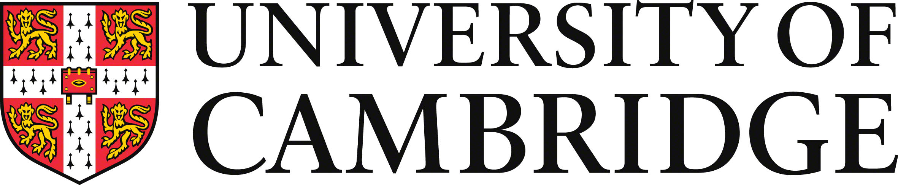

# Northeastern Neo-Aramaic Corpus

This is the
[Text-Fabric](https://github.com/annotation/text-fabric)
app for the
[Northeastern Neo-Aramaic Corpus](https://github.com/CambridgeSemiticsLab/nena_corpus).

